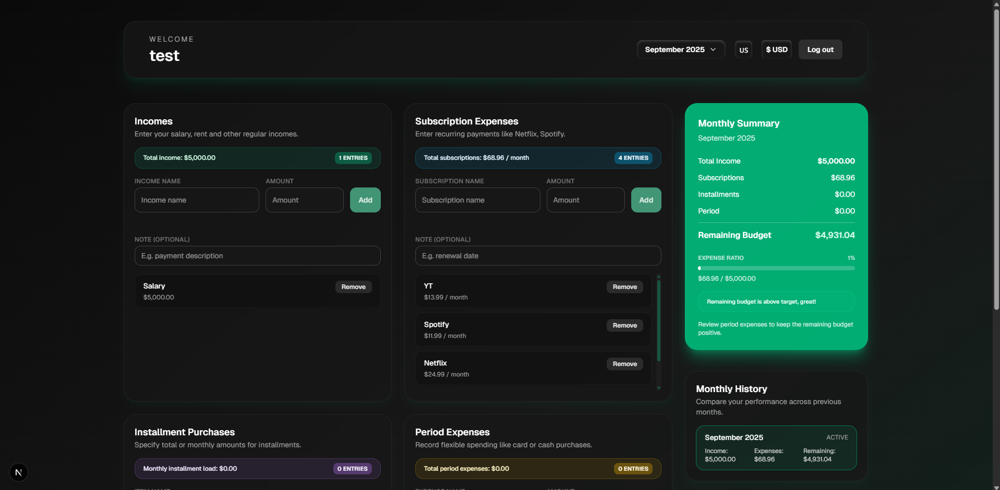
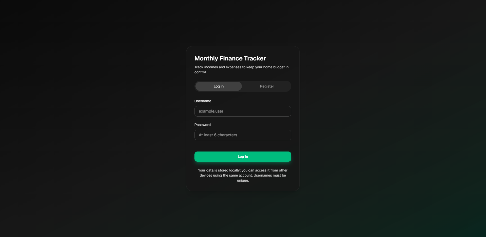
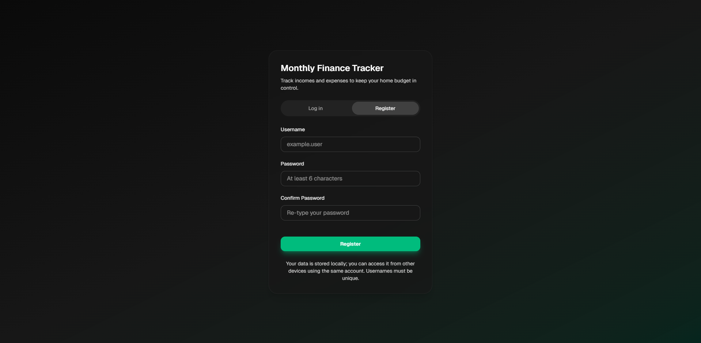

# Financial Tracker

This repository contains a small application built with Next.js and TypeScript for tracking personal finances. The project is open-source and contributions are welcome.

Note: I developed this project for my own use and am sharing it because I believe it may be useful to others.

## Features

- Simple income/expense recording and summary view
- Sections for subscriptions, installments, and periodic expenses
- Language and currency selection (i18n support)
- Local JSON-based storage
- Basic storage API routes implemented with Next.js

## Live demo

Try the running app at the hosted demo: https://financial-tracker-bai8.onrender.com/ — a quick way to test the app without running it locally.

## Tech Stack

- Next.js 15
- React 19
- TypeScript
- Tailwind CSS

## Quick Start (Windows PowerShell)

1. Clone the repository:

```powershell
git clone <repo-url>
cd financial-tracker
```

2. Install dependencies:

```powershell
npm install
# or, if you prefer
# pnpm install
# yarn install
```

3. Start the development server:

```powershell
npm run dev
# the app will be available at http://localhost:3000 by default
```

4. Build and run for production:

```powershell
npm run build
npm start
```

## Available npm scripts

- `npm run dev` — Start development server (Next.js with Turbopack)
- `npm run build` — Create a production build
- `npm start` — Start production server
- `npm run lint` — Run ESLint

## Docker

You can run the app in Docker for local development or production-like testing. The repository includes a `Dockerfile` and `docker-compose.yml` so you can use whichever workflow you prefer. Below are PowerShell-friendly examples.

- Using Docker Compose (recommended for local development):

```powershell
# from the project root
docker compose up --build
# the app will be available at http://localhost:3000 by default
```

- Using plain Docker (build and run):

```powershell
# build the image
docker build -t financial-tracker:local . ;
# run a container (maps port 3000 and mounts the project for live edits if desired)
docker run --rm -p 3000:3000 `
	-v ${PWD}:/app `
	-w /app `
	financial-tracker:local
```

Notes:
- The examples assume the app listens on port 3000 (Next.js default). If you change ports, update the `-p`/compose port mappings.
- When mounting the project directory into the container (`-v ${PWD}:/app`) you may need to adjust file permissions on Windows and ensure your host Node modules are available inside the container. For a pure immutable container, omit the volume mount.
- The `docker-compose.yml` in this repo is already set up to build and run the app; use `docker compose up --build` for the simplest flow.

### Use the published image (GitHub Container Registry)

If you prefer to use the pre-built image published to GitHub Container Registry, you can pull and run it directly. Example below uses the image tag `ghcr.io/nidea1/financial-tracker:0.1.0` which was pushed in the terminal output shown earlier.

```powershell
# pull the image
docker pull ghcr.io/nidea1/financial-tracker:0.1.0

# run it (detached, map port 3000)
docker run -d --name financial-tracker -p 3000:3000 ghcr.io/nidea1/financial-tracker:0.1.0

# view logs
docker logs -f financial-tracker

# stop and remove
docker stop financial-tracker ; docker rm financial-tracker
```

Notes on authentication and visibility:
- Replace the tag (`0.1.0`) with whatever version you want to use.

## Project Structure (short)

- `src/app/` — Next.js application code
- `src/components/` — UI components
- `src/lib/` — utilities (crypto, storage, types, etc.)
- `src/utils/` — formatters and helper functions
- `src/app/api/storage` — simple storage API routes

## Screenshots

Click thumbnails to open full-size images.

| Dashboard | Sign in | Sign up |
| --- | --- | --- |
| [](docs/screenshots/dashboard.png) | [](docs/screenshots/signin.png) | [](docs/screenshots/signup.png) |

## Runtime data

This project uses file-based JSON storage for example purposes. For a real production project, consider connecting a database or a remote storage service.

## Contributing

Contributions are welcome. Please read the contribution guidelines and code of conduct:

- `CONTRIBUTING.md`
- `CODE_OF_CONDUCT.md`

Feel free to open issues or submit pull requests for bug fixes, enhancements, or new features.

## License

This project is licensed under the MIT License — see the `LICENSE` file for details.

## Contact

If you have questions or suggestions, please open an issue.

---

Thanks — contributions are welcome!
